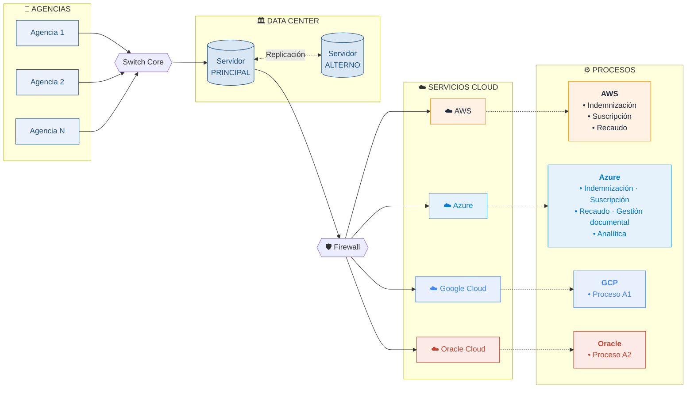

# Arquitectura de Infraestructura

## Versión Mermaid (renderiza en GitHub, Notion, Obsidian)

---

## Componentes

| Capa | Componentes | Descripción |
|---|---|---|
| **Agencias** | N sucursales | Puntos de acceso de usuarios finales |
| **Data Center** | Principal + Alterno | Replicación activa entre sitios |
| **Cloud** | AWS · Azure · GCP · Oracle | Estrategia multi-cloud por carga de trabajo |
| **Procesos** | Indemnización, Suscripción, Recaudo, Gestión documental, Analítica, A1, A2 | Servicios de negocio distribuidos según proveedor |

## Distribución de procesos

- **AWS** → Indemnización, Suscripción, Recaudo
- **Azure** → Indemnización, Suscripción, Recaudo, Gestión documental, Analítica
- **Google Cloud** → Proceso A1
- **Oracle Cloud** → Proceso A2
