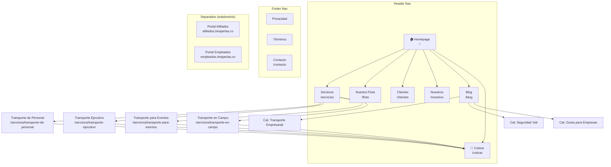

# SITE ARCHITECTURE — Tres Perlas (tresperlas.co)

**Cliente:** Tres Perlas — Transporte Empresarial y Turismo
**Agencia:** Picard-IA
**Fecha:** 2026-04-19
**Site Type:** Small business / Servicio B2B local con proyección nacional
**Estado:** Reestructuración de sitio existente (activo desde ~2019)

---

## ESTADO ACTUAL

### Estructura actual (5 páginas, 1 nivel)

```
Homepage (/)
├── Quiénes somos (/#quienes-somos)   ← sección en homepage
├── Servicios (/#servicios)            ← sección en homepage
├── Clientes (/#clientes)              ← sección en homepage
├── Contáctenos (/#contacto)           ← sección en homepage
├── Ingreso Afiliados (/afiliados?)    ← portal interno
└── Acceso Empleados (/empleados?)     ← portal interno
```

### Problemas de la arquitectura actual

| # | Problema | Impacto |
|---|---------|---------|
| 1 | Todo es una sola página (one-pager) | No hay URLs indexables individuales para SEO |
| 2 | Sin páginas de servicios individuales | No rankea para "transporte ejecutivo Bogotá", "transporte de personal Bogotá", etc. |
| 3 | Sin blog ni contenido | Cero oportunidades de tráfico orgánico long-tail |
| 4 | Portales internos (afiliados/empleados) mezclados con sitio comercial | Confunde al visitante — piensa que es intranet |
| 5 | Sin página de flota/vehículos | El diferenciador principal (flota propia diversificada) no tiene página dedicada |
| 6 | Sin URLs limpias para compartir | No se puede enviar "mira nuestro servicio de transporte ejecutivo" con un link directo |
| 7 | Sin breadcrumbs ni sitemap | Google no entiende la jerarquía |

---

## NUEVA ARQUITECTURA PROPUESTA

### Principios de diseño

1. **Flat (2 niveles máximo)** — sitio pequeño, no necesita profundidad
2. **Una página por servicio** — cada servicio rankea por su propia keyword
3. **Blog desde el inicio** — aunque se publique después, la estructura debe estar lista
4. **Portales internos separados** — afiliados y empleados en subdominio o sección aparte
5. **Todas las páginas a máximo 2 clicks del homepage**

---

### Page Hierarchy (ASCII Tree)

```
Homepage (/)
│
├── Servicios (/servicios)
│   ├── Transporte de Personal (/servicios/transporte-de-personal)
│   ├── Transporte Ejecutivo (/servicios/transporte-ejecutivo)
│   ├── Transporte para Eventos (/servicios/transporte-para-eventos)
│   └── Transporte en Campo (/servicios/transporte-en-campo)
│
├── Nuestra Flota (/flota)
│
├── Clientes (/clientes)
│
├── Nosotros (/nosotros)
│
├── Blog (/blog)
│   ├── [Categoría: Transporte Empresarial] (/blog/categoria/transporte-empresarial)
│   ├── [Categoría: Seguridad Vial] (/blog/categoria/seguridad-vial)
│   └── [Categoría: Guías para Empresas] (/blog/categoria/guias-empresas)
│
├── Cotizar (/cotizar)
│
├── Contacto (/contacto)
│
├── Comparaciones (fase 2)
│   ├── Tres Perlas vs Uber Business (/comparar/uber-business)
│   ├── Tres Perlas vs Flota Propia (/comparar/flota-propia)
│   └── Tres Perlas vs Transportador Informal (/comparar/transportador-informal)
│
└── Legal
    ├── Política de Privacidad (/privacidad)
    └── Términos y Condiciones (/terminos)

── Subdominios / Separados ──
├── Portal Afiliados (afiliados.tresperlas.co o /portal/afiliados)
└── Portal Empleados (empleados.tresperlas.co o /portal/empleados)
```

---

### Visual Sitemap (Mermaid)



---

## URL MAP

| # | Página | URL | Parent | Nav Location | Prioridad SEO | Keyword objetivo |
|---|--------|-----|--------|-------------|--------------|-----------------|
| 1 | Homepage | `/` | — | Header | Alta | transporte empresarial bogotá |
| 2 | Servicios (hub) | `/servicios` | Homepage | Header | Alta | servicios de transporte empresarial |
| 3 | Transporte de Personal | `/servicios/transporte-de-personal` | Servicios | Header dropdown | Alta | transporte de personal bogotá |
| 4 | Transporte Ejecutivo | `/servicios/transporte-ejecutivo` | Servicios | Header dropdown | Alta | transporte ejecutivo bogotá |
| 5 | Transporte para Eventos | `/servicios/transporte-para-eventos` | Servicios | Header dropdown | Media | transporte para eventos corporativos |
| 6 | Transporte en Campo | `/servicios/transporte-en-campo` | Servicios | Header dropdown | Media | transporte 4x4 zona rural colombia |
| 7 | Nuestra Flota | `/flota` | Homepage | Header | Alta | alquiler vans buses empresas bogotá |
| 8 | Clientes | `/clientes` | Homepage | Header | Baja | — (social proof) |
| 9 | Nosotros | `/nosotros` | Homepage | Header | Baja | empresa transporte especial habilitada |
| 10 | Blog (hub) | `/blog` | Homepage | Header | Alta | — (tráfico orgánico) |
| 11 | Cotizar | `/cotizar` | Homepage | Header (CTA) | Media | cotizar transporte empresarial |
| 12 | Contacto | `/contacto` | Homepage | Footer | Baja | — |
| 13 | Privacidad | `/privacidad` | Homepage | Footer | Ninguna | — |
| 14 | Términos | `/terminos` | Homepage | Footer | Ninguna | — |

### URLs futuras (Fase 2+)

| Página | URL | Prioridad SEO | Keyword objetivo |
|--------|-----|--------------|-----------------|
| TP vs Uber Business | `/comparar/uber-business` | Alta | uber business vs transporte empresarial |
| TP vs Flota Propia | `/comparar/flota-propia` | Media | ventajas tercerizar transporte empresarial |
| TP vs Informal | `/comparar/transportador-informal` | Media | transporte empresarial formal vs informal |
| Checklist descargable | `/recursos/checklist-transporte` | Media | cómo elegir empresa transporte |

---

## NAVIGATION SPEC

### Header Nav (sticky)

```
┌──────────────────────────────────────────────────────────────────────┐
│  [Logo TP]   Servicios ▼  |  Flota  |  Clientes  |  Nosotros  |  Blog  |  📞  |  [Cotizar] │
└──────────────────────────────────────────────────────────────────────┘
```

**Orden (izquierda a derecha):**
1. Logo (link a homepage)
2. Servicios (dropdown con 4 servicios)
3. Nuestra Flota
4. Clientes
5. Nosotros
6. Blog
7. Ícono teléfono (click-to-call mobile)
8. **[Cotizar Ahora]** — botón CTA destacado (derecha)

**Dropdown de Servicios:**
```
┌─────────────────────────────────┐
│  Transporte de Personal         │
│  Rutas diarias para su equipo   │
│─────────────────────────────────│
│  Transporte Ejecutivo           │
│  Sedanes y camionetas premium   │
│─────────────────────────────────│
│  Transporte para Eventos        │
│  Convenciones y team buildings  │
│─────────────────────────────────│
│  Transporte en Campo            │
│  4x4 para zonas rurales         │
└─────────────────────────────────┘
```

Cada ítem del dropdown tiene título + descripción corta de 1 línea.

### Footer Nav

```
┌──────────────────────────────────────────────────────────────────┐
│  [Logo Tres Perlas]                                              │
│                                                                  │
│  Servicios           Empresa           Contacto                  │
│  ─────────           ───────           ────────                  │
│  Personal            Nosotros          📞 (316) 334 4149         │
│  Ejecutivo           Clientes          📧 info@tresperlas.co     │
│  Eventos             Flota             💬 WhatsApp               │
│  Campo               Blog              📍 Bogotá, Colombia       │
│                      Cotizar                                     │
│                                                                  │
│  ─────────────────────────────────────────────────────────────── │
│  © 2026 Tres Perlas S.A.S. — Transporte Empresarial              │
│  Empresa habilitada por el Ministerio de Transporte              │
│  Privacidad  |  Términos  |  Diseño: Picard-IA                  │
└──────────────────────────────────────────────────────────────────┘
```

### Breadcrumbs

Implementar en todas las páginas excepto homepage.

| Página | Breadcrumb |
|--------|-----------|
| Transporte de Personal | Inicio > Servicios > Transporte de Personal |
| Transporte Ejecutivo | Inicio > Servicios > Transporte Ejecutivo |
| Nuestra Flota | Inicio > Nuestra Flota |
| Blog post | Inicio > Blog > [Categoría] > [Título del post] |
| Cotizar | Inicio > Cotizar |
| Nosotros | Inicio > Nosotros |

---

## CONTENIDO POR PÁGINA

### Páginas de servicio (template)

Cada página de servicio sigue la misma estructura:

```
1. Hero con headline específico del servicio + CTA "Cotizar este servicio"
2. Problema que resuelve (dolor del cliente)
3. Cómo funciona (proceso 3 pasos)
4. Tipos de vehículos disponibles (con fotos)
5. Por qué elegirnos para este servicio (3 diferenciadores)
6. Testimonial de cliente de este tipo de servicio
7. Preguntas frecuentes (FAQ — 4-5 preguntas, SEO + schema)
8. CTA final "Cotizar [servicio]" + alternativa WhatsApp
```

### Página: Transporte de Personal (`/servicios/transporte-de-personal`)

| Sección | Contenido |
|---------|-----------|
| **H1** | Transporte de personal para su empresa en Bogotá |
| **Hero sub** | Rutas diarias seguras y puntuales para sus equipos de trabajo. Flota propia, conductores fijos, GPS en tiempo real. |
| **CTA** | [Cotizar rutas de personal] |
| **Problema** | "Coordinar el transporte diario de su equipo no debería ser un dolor de cabeza. Conductores que no llegan, vehículos con papeles vencidos, y la responsabilidad legal recae en usted." |
| **Vehículos** | Vans (5-15 personas), Microbuses (16-30), Buses (30+) |
| **FAQ** | ¿Cuántos pasajeros por ruta? / ¿Incluye conductor? / ¿Qué pasa si un vehículo falla? / ¿Cómo verifico la documentación? |

### Página: Transporte Ejecutivo (`/servicios/transporte-ejecutivo`)

| Sección | Contenido |
|---------|-----------|
| **H1** | Transporte ejecutivo en Bogotá y toda Colombia |
| **Hero sub** | Vehículos premium con conductor profesional para directivos, clientes VIP y visitantes internacionales. |
| **CTA** | [Cotizar transporte ejecutivo] |
| **Problema** | "La imagen de su empresa se refleja en cómo transporta a sus ejecutivos y clientes. Un taxi o un Uber no comunica el mismo nivel de profesionalismo." |
| **Vehículos** | Sedanes de lujo, Camionetas 4x4 |
| **FAQ** | ¿Servicio aeropuerto? / ¿Conductor bilingüe? / ¿Disponibilidad 24/7? / ¿Facturación electrónica? |

### Página: Transporte para Eventos (`/servicios/transporte-para-eventos`)

| Sección | Contenido |
|---------|-----------|
| **H1** | Transporte para eventos corporativos en Colombia |
| **Hero sub** | Logística completa de transporte para convenciones, team buildings, lanzamientos y eventos de empresa. De 10 a 500+ personas. |
| **CTA** | [Cotizar transporte para mi evento] |
| **Problema** | "Organizar un evento ya es suficiente trabajo. No debería preocuparse también por cómo llegan y se van 200 personas." |
| **Vehículos** | Toda la flota: vans, microbuses, buses |
| **FAQ** | ¿Con cuánta anticipación debo reservar? / ¿Manejan múltiples rutas simultáneas? / ¿Incluye coordinador? / ¿Qué pasa si cambia el número de personas? |

### Página: Transporte en Campo (`/servicios/transporte-en-campo`)

| Sección | Contenido |
|---------|-----------|
| **H1** | Transporte 4x4 para operaciones en campo |
| **Hero sub** | Camionetas doble cabina y camperos preparados para trocha, zonas rurales y operaciones mineras, petroleras e industriales. |
| **CTA** | [Cotizar transporte en campo] |
| **Problema** | "Sus operaciones no paran porque la vía está mala. Su transporte tampoco debería." |
| **Vehículos** | Camionetas doble cabina 4x4, Camperos de lujo |
| **FAQ** | ¿Qué zonas cubren? / ¿Vehículos blindados? / ¿Conductor con experiencia en trocha? / ¿Seguro todo riesgo? |

### Página: Nuestra Flota (`/flota`)

| Sección | Contenido |
|---------|-----------|
| **H1** | Nuestra flota de transporte empresarial |
| **Hero sub** | Vehículos propios para cada necesidad. Desde sedán ejecutivo hasta bus de 40 pasajeros. Toda la documentación al día y verificable. |
| **Contenido** | Galería/grid de vehículos por tipo con foto + capacidad + características |
| **Trust** | "Verifique SOAT, seguros y revisión técnico-mecánica de cualquier vehículo en nuestro portal" |
| **CTA** | [Cotizar con el vehículo ideal para mi necesidad] |

### Página: Nosotros (`/nosotros`)

| Sección | Contenido |
|---------|-----------|
| **H1** | Sobre Tres Perlas — Transporte empresarial de confianza |
| **Contenido** | Historia de la empresa (años, evolución), equipo directivo, habilitación Ministerio de Transporte, valores operacionales (no corporativos genéricos), cobertura geográfica |
| **Diferencial** | Aquí van misión/visión SOLO si se reescriben de forma concreta y relevante |
| **CTA** | [Conozca nuestra flota] o [Cotizar] |

### Página: Cotizar (`/cotizar`)

| Sección | Contenido |
|---------|-----------|
| **H1** | Cotice su transporte empresarial |
| **Contenido** | Formulario multi-step (ver documento form-cro) + alternativa WhatsApp + datos de contacto directo |
| **Trust** | "Sin compromiso. Respondemos en menos de 24 horas." |

---

## INTERNAL LINKING PLAN

### Hub-and-Spoke: Servicios

```
Hub: /servicios (overview de todos los servicios)
├── Spoke: /servicios/transporte-de-personal → link a /flota, /cotizar, /clientes
├── Spoke: /servicios/transporte-ejecutivo → link a /flota, /cotizar, /clientes
├── Spoke: /servicios/transporte-para-eventos → link a /flota, /cotizar
└── Spoke: /servicios/transporte-en-campo → link a /flota, /cotizar
```

### Hub-and-Spoke: Blog (futuro)

```
Hub: /blog/transporte-empresarial-guia-completa
├── Spoke: /blog/como-elegir-empresa-transporte-empresarial → link a hub, /servicios
├── Spoke: /blog/transporte-personal-vs-flota-propia → link a hub, /comparar/flota-propia
├── Spoke: /blog/documentacion-transporte-especial-colombia → link a hub, /nosotros
└── Spoke: /blog/seguridad-transporte-corporativo → link a hub, /servicios/transporte-en-campo
```

### Cross-Section Links

| Desde | Hacia | Anchor text |
|-------|-------|------------|
| Cada página de servicio | `/cotizar` | "Cotizar este servicio" |
| Cada página de servicio | `/flota` | "Ver los vehículos disponibles" |
| `/flota` | Cada servicio relevante | "Ideal para transporte de personal" |
| `/clientes` | Servicios mencionados en testimonial | "Conocer nuestro servicio de transporte ejecutivo" |
| `/nosotros` | `/flota` | "Conozca nuestra flota" |
| `/nosotros` | `/clientes` | "Empresas que confían en nosotros" |
| Blog posts | Servicios relacionados | Contextual dentro del contenido |
| Blog posts | `/cotizar` | CTA inline y al final del artículo |
| Homepage | Cada servicio | Cards de servicios linkeados |
| Homepage | `/cotizar` | CTA hero, CTA final |
| Homepage | `/flota` | Sección de flota con link |

### Checklist de linking

- [ ] Ninguna página huérfana (todas tienen al menos 1 link entrante)
- [ ] Todas las páginas de servicio linkeadas desde homepage, header y footer
- [ ] `/cotizar` linkeado desde todas las páginas (mínimo 1 CTA por página)
- [ ] Breadcrumbs en todas las páginas excepto homepage
- [ ] Blog posts con links a servicios y a `/cotizar`
- [ ] Footer con links a todas las secciones principales

---

## REDIRECTS (URLs actuales → nuevas)

| URL actual (estimada) | URL nueva | Tipo |
|----------------------|-----------|------|
| `/#quienes-somos` | `/nosotros` | 301 |
| `/#servicios` | `/servicios` | 301 |
| `/#clientes` | `/clientes` | 301 |
| `/#contacto` | `/contacto` | 301 |
| `/afiliados` (portal) | `afiliados.tresperlas.co` | 301 (subdominio) |
| `/empleados` (portal) | `empleados.tresperlas.co` | 301 (subdominio) |

**Nota:** Como el sitio actual es one-pager con anchors (#), probablemente no hay URLs indexadas en Google. Verificar en Search Console. Si no hay URLs indexadas, los redirects son menos críticos.

---

## PORTALES INTERNOS — SEPARACIÓN

### Problema actual
Los botones "Ingreso Afiliados" y "Acceso Empleados" están en el sitio comercial. Esto confunde al visitante y compite con los CTAs de conversión.

### Solución

**Opción A — Subdominios (recomendada):**
- `afiliados.tresperlas.co` → Portal de afiliados (consulta SOAT, documentos)
- `empleados.tresperlas.co` → Portal de empleados

**Opción B — Ruta separada:**
- `tresperlas.co/portal/afiliados`
- `tresperlas.co/portal/empleados`

**En ambos casos:**
- Remover "Ingreso Afiliados" y "Acceso Empleados" del header principal
- Agregar link discreto en el footer: "Portal Afiliados | Portal Empleados"
- Los portales tienen su propia navegación, separada del sitio comercial

---

## RESUMEN DE CAMBIOS

| Aspecto | Actual | Propuesto |
|---------|--------|-----------|
| Páginas | 1 (one-pager) | 14+ páginas individuales |
| Niveles | 1 | 2 (flat) |
| URLs indexables | 1 | 14+ |
| Páginas de servicio | 0 individuales | 4 |
| Blog | No existe | Estructura lista (3 categorías) |
| Página de flota | No existe | 1 dedicada |
| Formulario de cotización | Sección en homepage | Página dedicada `/cotizar` |
| Portales internos | En header principal | Subdominio o footer discreto |
| Breadcrumbs | No | Sí, en todas las páginas |
| Footer | Mínimo (1 línea) | Completo con 3 columnas + legal |
| Páginas de comparación | No | 3 planificadas (fase 2) |

---

## IMPLEMENTACIÓN POR FASES

### Fase 1 — MVP (semana 1-2)
1. Homepage rediseñada (con nueva estructura del page-cro)
2. 4 páginas de servicios individuales
3. Página de flota
4. Página de cotización (formulario del form-cro)
5. Página de contacto
6. Header y footer nuevos
7. Breadcrumbs
8. Separar portales internos del header

### Fase 2 — Contenido (semana 3-4)
1. Página "Nosotros" reescrita
2. Página "Clientes" con testimoniales
3. Blog (estructura + 2-3 artículos iniciales)
4. Privacidad y términos

### Fase 3 — SEO agresivo (mes 2+)
1. Páginas de comparación (vs Uber, vs flota propia, vs informal)
2. Contenido de blog regular (2-4 posts/mes)
3. Recurso descargable (checklist transporte empresarial)
4. Landing pages para Google Ads

---

## SIGUIENTE PASO

Prioridad 1 del roadmap está completa. El siguiente bloque es **Prioridad 2 — Generar tráfico y leads**:

| # | Skill | Para qué |
|---|-------|----------|
| 1 | `/seo-audit` | Auditoría técnica del sitio actual |
| 2 | `/schema-markup` | Datos estructurados (LocalBusiness, TransportService, FAQ) |
| 3 | `/content-strategy` | Plan de blog y contenido SEO |
| 4 | `/ai-seo` | Optimizar para búsquedas en ChatGPT/Gemini/Perplexity |

---

*Documento generado: 2026-04-19*
*Picard-IA — Skill: site-architecture*
*Base: product-marketing-context.md + page-cro + form-cro + diagnóstico digital*
